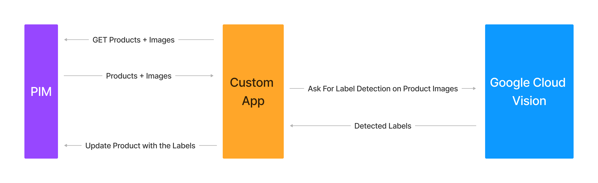
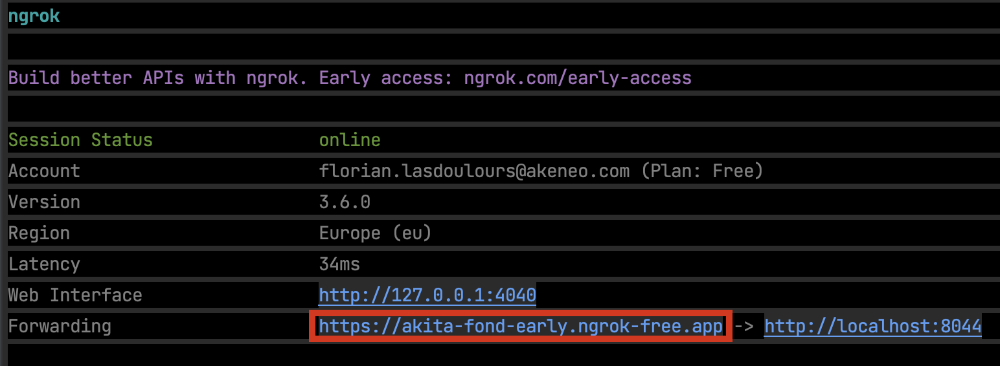

# apps-workshop-partners

# Introduction and Goals
In that course we will initialize an Akeneo custom app that interacts with Google Vision API 
in order to extract labels from product images and assign these identified labels to the products informations in the PIM.




## Step 1 - Initialization : 

### Checkout the Demo App Skeleton :
In this step, you'll need to download the latest Release from the Akeneo PIM Workshop App from the provided GitHub repository. 
This app will serve as the foundation for your custom app.
Follow the steps below to get started:

### Prerequisites

Before you begin, ensure that you have the following installed on your development environment:

* Docker Desktop : https://www.docker.com/products/docker-desktop/ : Once installed  => start it
* NGrok : [installation](https://ngrok.com/download)

### Steps
1. Download the latest release of the Akeneo PIM Workshop App repository from that url https://github.com/akeneo-presales/WorkshopCustomApp/releases
2. Unzip the archive
3. Open your terminal or command prompt.
4. Navigate to the directory where you have uncompressed the project archive.
5. Start the docker stack by running the following script from the project root directory :
    - For Linux / MacOS (Intel x86)
    ```
    ./start.sh
    ```
    - For Linux / MacOS (ARM64)
    ```
    ./start_arm64.sh
    ```
   - For Windows
    ```
    ./start.bat
    ```
6. Check that the app is running by opening the following url : http://localhost:8044

## Step 2 - Configure the OAuth Scopes required by the App

An Akeneo Custom App should declare the OAuth scopes that are needed for its execution.
These scopes are declared In the Activate step.
Edit the ActivateAction Controller class where you'll find all the informations about it

````php
final class ActivateAction extends AbstractController
{
    /* List the oAuth scopes required by your app
    In our case we need to complete the list by adding the following scopes :
    Read and write products, Read assets and asset families
    See the documentation here :
    https://api.akeneo.com/apps/authentication-and-authorization.html#available-authorization-scopes
*/
    private const OAUTH_SCOPES = [
        'read_catalog_structure',
        'read_channel_localization',
        'read_channel_settings',
        'read_catalogs',
        'openid',
        'profile',
        'email',
    ];

````

## Step 3 - Connect the app to your PIM

**Requirements:**
- You have a [PIM developer sandbox](https://api.akeneo.com/apps/overview.html#app-developer-starter-kit)

**Steps:**
- Run Ngrok to obtain a temporary public URL for your local app, to do so run : ``ngrok http 8044``!

- [Register your app](https://api.akeneo.com/tutorials/how-to-get-your-app-token.html#step-3-declare-your-local-app-as-a-custom-app-in-your-sandbox-to-generate-credentials) to generates and receive the credentials, the activate url is : https://your-ngrok-url/ and the callback url is https://your-ngrok-url/callback
- Once the app registered in the PIM, you can [Connect to your app](https://api.akeneo.com/tutorials/how-to-get-your-app-token.html#step-4-run-your-local-app)
- then you will be prompted to register your PIM environment by providing the client id and the client secret you get on the previous step

## Step 4: Configure and activate a Catalog

Going back to the PIM we have to enable the catalog for our app.
Adding a filter on the family to retrieve only the products we wants.

## Step 5: Install Third-Party API Client and add Service Account configuration

### Add the google/cloud-vision dependency

In this step, you will install the Third-Party API client for addressing the Google Vision API, which will be used in your custom app. 
Follow the steps below to integrate the client into your project:

1. Open your terminal or command prompt.
2. Run the following command within your Docker container to install the Google AI Generative API client using Composer:

    ``bash
    docker exec -it workshopApp_web composer require google/cloud-vision
    ``

Now you have successfully installed the Third-Party API client for addressing the Google AI Generative API within your Dockerized Akeneo PIM app. Proceed to the next steps to configure and utilize this client within your custom app.

### install Google Cloud Service Account
in order to request the Google Cloud Vision API, the Google Client should be authenticated, 
to do so we will use a Service account that has rights to request the Google Cloud Vision Service.
We will provide you it's content for the time of the workshop.

Copy the service account credentials json key into a service_account.json file at the root of the project.


## Step 3 : Coding

In order to cover the use case presented in the introduction we will code a few things.
All that we will need to do will be centralized in a single Service Class : GoogleVisionService
the central method is detectLabelsOnProductImages, in that method we request the products through the catalog connection.
Foreach products that have their packshot asset collection described do the following :
- 3.1 Extract the image
in the **extractAssetImage** method implement the download of an asset content through the api
````php
private function extractAssetImage(AkeneoPimClientInterface $client, string $assetDataCode)
{
$mediaContent ='';

     /*
      * CODING
      * Extract the asset media datas (image binary data) from the ÀPI
      * store these data into the mediaContent var
      * See this documentation to find out how to do it
      * https://api.akeneo.com/php-client/resources.html#asset-media-file
      */
     $mediaContent = '';

     $tempFile = tempnam('/tmp', 'assetGoogleVision');
     file_put_contents($tempFile, $mediaContent);

     return $tempFile;
}
````
- 3.2 Call the Google Vision Service to detect labels over the image
the method **getLabelsForImage** receives an image path as argument. 
Code the little logic to call the Google Vision API to retrieve the labels and store them in the result array.
````php
 private function getLabelsForImage($imagePath)
    {
        $image = file_get_contents($this->projectDir.'/public/'.$imagePath);

        $result = [];

        /* NOW IT'S YOUR TIME TO CODE!!
        BE INSPIRED BY THIS GOOGLE DOCUMENTATION PAGE
        https://cloud.google.com/vision/docs/samples/vision-label-detection
        */
        $imageAnnotator = new ImageAnnotatorClient(['credentials'=>$this->projectDir.'/service_account.json']);

        /*
        END OF YOUR CODE
        */

        return $result;
    }
````
- 3.3 Update the product product_tags attribute with the detected labels value by using the API client

````php

    private function updateProduct(AkeneoPimClientInterface $client, mixed $productUuid, array $labels, ?string $locale = 'en_US', ?string $scope = 'ecommerce')
    {

        $product = [
            'uuid' => $productUuid,
            'values' => [
                // update product_tags attribute
            ]
        ];

        /*
         * CODING
         * Update the product using its UUID with the tags that we retrieved from Google Vision API
         * See the documentation :
         * https://api.akeneo.com/php-client/resources.html#upsert-a-product-2
         */

        $response = '???';
        $response = $client->getProductUuidApi()->upsert($productUuid, $product);

        $this->checkUpsertResponse($response);
    }
````

## Information about the PIM catalog Structure

All products have a **packshot** asset_collection attribute which handles the product images.

Also a **product_tags** textarea attribute has been also added, this field will receive the detected labels from the app.
