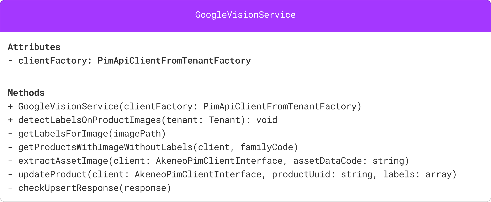

# apps-workshop-partners

# Introduction and Goals
In that course we will initialize an Akeneo custom app that interacts with Google Vision API 
in order to extract labels from product images and assign these identified labels to the products informations in the PIM.


## Step 1 - Initialization : 

### Checkout the Demo App Skeleton :
In this step, you'll need to download the latest Release from the Akeneo PIM Workshop App from the provided GitHub repository. 
This app will serve as the foundation for your custom app. 
Follow the steps below to get started:

### Prerequisites

Before you begin, ensure that you have the following installed on your development environment:

* Git client : https://git-scm.com/downloads
* Docker Desktop : https://www.docker.com/products/docker-desktop/ : Once installed  => start it

### Steps
1. Open your terminal or command prompt.
2. Navigate to the directory where you want to store your project.
3. Download the latest release of the Akeneo PIM Workshop App repository from that url https://github.com/akeneo-presales/WorkshopCustomApp/releases
4. Unzip the archive
5. Start the docker stack by running the following script from the project root directory :
    - For Linux / MacOS
    ```
    ./start.sh
    ```
    - For Linux / MacOS (ARM64)
    ```
    ./start_arm64.sh
    ```
   - For Windows
    ```
    ./start.bat
    ```
6. Check that the app is running by opening the following url : http://localhost:8044

### Connect the app to your PIM

**Requirements:**
- You have a [PIM developer sandbox](https://api.akeneo.com/apps/overview.html#app-developer-starter-kit)

**Steps:**
- Run Ngrok to open your local app to the internet, [install it](https://ngrok.com/download) and then run : ``ngrok http 8044`` (where 8044 is related to the DOCKER_PORT_HTTP constant value declared in the [Makefile](https://github.com/akeneo-presales/app-skeleton/blob/main/Makefile#L13) file), then you'll get a public ngrok url that you should use in the next steps
- [Register your app](https://api.akeneo.com/tutorials/how-to-get-your-app-token.html#step-3-declare-your-local-app-as-a-custom-app-in-your-sandbox-to-generate-credentials) to generates and receive the credentials, the activate url is : https://your-ngrok-url/ and the callback url is https://your-ngrok-url/callback
- Once the app registered in the PIM, you can [Connect to your app](https://api.akeneo.com/tutorials/how-to-get-your-app-token.html#step-4-run-your-local-app), then you will be prompted to register your PIM environment by providing the client id and the client secret you get on the previous step


## Step 2: Install Third-Party API Client and add Service Account configuration

### Add the google/cloud-vision dependency

In this step, you will install the Third-Party API client for addressing the Google Vision API, which will be used in your custom app. 
Follow the steps below to integrate the client into your project:

1. Open your terminal or command prompt.
2. Run the following command within your Docker container to install the Google AI Generative API client using Composer:

    ``bash
    docker exec -it workshopApp_web composer require google/cloud-vision
    ``

Now you have successfully installed the Third-Party API client for addressing the Google AI Generative API within your Dockerized Akeneo PIM app. Proceed to the next steps to configure and utilize this client within your custom app.

### install Google Cloud Service Account
in order to request the Google Cloud Vision API, the Google Client should be authenticated, 
to do so we will use a Service account that has rights to request the Google Cloud Vision Service.
We will provide you it's content for the time of the workshop.

Copy the service account credentials json key into a service_account.json file at the root of the project.

## Step 3 : Coding a central service class

In that step we will code a Service class in the Service Folder, GoogleVisionService.
Here is the class diagram :



In order to cover the use case presented in the introduction we will implement each step in a dedicated method, each steps will be piloted from a central main method called **detectLabelsOnProductImages**

* The **PimApiClientFromTenantFactory** clientFactory attribute is "injected" through the constructor. 
This Factory object will give us the ability to generate an API client based on the current tenant.

* The private method **getLabelsForImage** receives an image path as argument, and then it will call the Google Vision API to retrieve the labels.
To code the method logic you can find the inspiration from what is presented here : https://cloud.google.com/vision/docs/samples/vision-label-detection?#vision_label_detection-php

* The **detectLabelsOnProductImages** method will use the clientFactory attribute to retrieve a PIM API Client based on the Tenant argument, 
With that client we will use the **ProductAPI** to list the products in a specific family filtered by the following criteria : asset collection attribute defined (packshot not empty), and no detected labels yet (product_labels empty).
Then, for each product, you will need to request the **AssetManagerAPI** for downloading locally the asset image [show documentation](https://api.akeneo.com/php-client/resources.html#asset-media-file) (Tip: extract the asset Family Code before from the **AttributeApi** by getting the packshot attribute and extracting the reference_data_name property).
Store the image data in a local temp file (use [tempnam](https://www.php.net/manual/function.tempnam.php)) and make a call to the getLabelsForImage method to retrieve the labels.
Finally, you will make a product update API request with the labels separated by a comma.

Correction => [GoogleVisionService.php](GoogleVisionService.php)

## Step 4: Update the product list page

Create a new Symfony action with a dedicated route where you will use the GoogleVisionService detectLabelsOnProductImages method 

Call this route from the Detect Tags button situated on the products list page


## Step 5: Create a Commandline action

Create a new Symfony command **products:detect-tags** where you will use the GoogleVisionService detectLabelsOnProductImages method on each tenant registered onto the instance.

you can be inspired by the ExampleCommand class situated in src/Command to create your own command.

This command could be triggerd mannually through a shell console :

`docker exec -it workshopApp bin/console products:detect-tags`

## Information about the PIM catalog Structure

All products have a **packshot** asset_collection attribute which handles the product images.

Also a **product_tags** textarea attribute has been also added, this field will receive the detected labels from the app.
